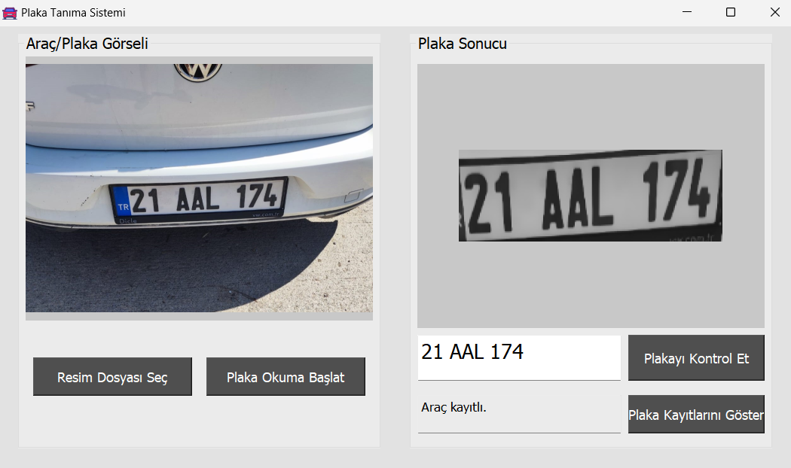
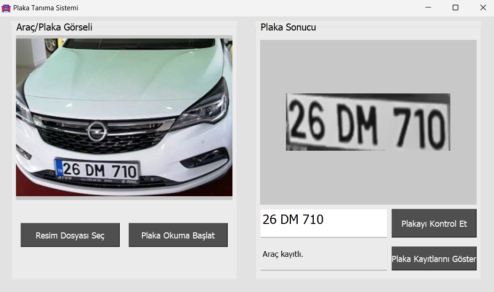
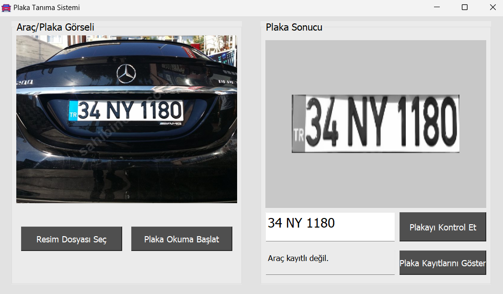
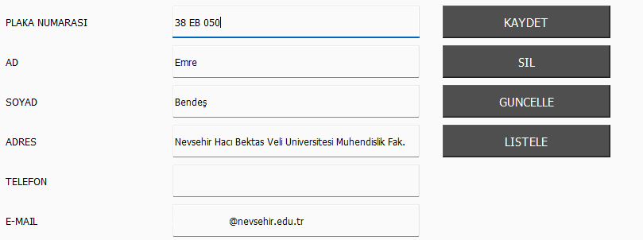
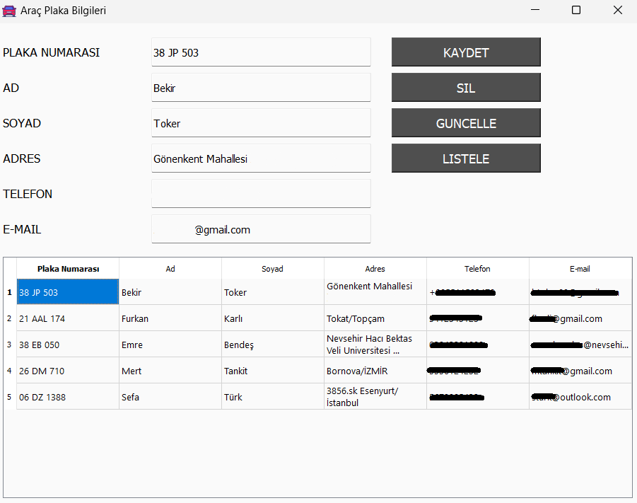

# Tesseract OCR Plaka Tanıma Sistemi
Python ve OpenCV ile plaka tanıma sistemi projesi.

Projeyi çalıştırmak için, projeyi indirdiğiniz dizinin komut isteminde aşağıdaki komutu yazabilirsiniz:
```python
python CarPlateRecognitionSystem.py
```
## 📷 Proje Görselleri

### 🚘 Örnek Plaka Tespitleri




### 🖥️ Kayıt Ekranı


### 📋 Kayıtlı Plakalar

